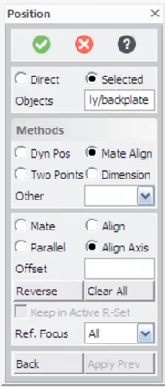

# Design Backlog

Running list of design threads that are open, named, and deliberately
not yet built -- captured here so they don't get lost between
sessions. Add to this as new threads come up; move items to the
relevant area's own doc (or into actual code) once they're resolved.

---

## 1. Position / Mate-Align workflow (HP/CoCreate pattern)

**Status:** design fully resolved, ready to build. All groundwork
proven (see §5). Waiting on nothing -- the PTC documentation attached
this session answered the last open question.

**Scope (deliberately narrow):** implementing just 2 of CoCreate's
positioning techniques, sufficient for the 90% use case (importing
STEP files and positioning them into an assembly):

1. **Dynamic positioning** -- drag a part to get it out of the way
   of overlapping geometry so you can see it clearly before Mate/Align.
2. **Mate/Align** -- precision placement using face/edge/axis picks.

---

### Typical workflow this supports

1. Import a STEP file → part/assembly appears at top level near origin
2. Drag it in the tree to the correct parent assembly (already works)
3. **Dynamic Move** → drag it somewhere visible, away from existing
   geometry (new)
4. **Mate/Align** → precision placement relative to the assembly (new)

---

### Mate/Align: fully designed

**Source:** PTC Creo Elements/Direct Modeling Express documentation,
read directly from the attached PDFs ("Mate or align parts and
assemblies" + "Position a part, assembly, or workplane set").

**The open design question is now answered:** each Mate/Align step
commits **immediately** -- "the parts or assemblies become constrained
by each mate or align step." The part moves after each pick pair, not
batched until a final Apply. "Back" undoes one step; "Clear All"
resets the constraint method but leaves the part at its current
(moved) position. This is simpler to implement than the batched
version would have been.

**Constraint types** (confirming Doug's 3-2-1 characterization):
- **Mate**: two faces opposing each other on the same plane (face-to-
  face contact). Constrains 3 DOF: the normal direction + 2
  in-plane translations.
- **Align**: two faces/elements on the SAME side of a plane (flush).
  Constrains 2 additional DOF.
- **Align Axis**: aligns the axes of two cylindrical/circular
  elements. Maps directly onto `circle_axis` DirectionRef picks,
  already proven working on real STEP geometry.
- **Parallel**: makes faces/edges parallel without coincident
  placement (not in our minimal scope, but documented for later).
- **Offset**: adds a gap value to Mate or Align (not in minimal
  scope, but trivial to add once the basic case works).

**How a single Mate/Align step works:**
1. User picks a face/edge/axis on the **moving part** →
   `PointRef`/`DirectionRef` resolve it to a point + direction
   (already proven working for face, straight edge, circular edge)
2. User picks the corresponding face/edge/axis on the **fixed
   target** → same resolution
3. Choose constraint type (Mate/Align/Align Axis)
4. Compute the move: `compute_move(from_plane, to_plane)` from
   `pose.py` -- already implemented, already self-tested
5. Apply immediately: `moving_part.move(delta)` -- proven via the
   rod-move test tonight
6. Repeat steps 1-5 for each additional constraint (up to 3 to
   fully constrain all 6 DOF -- the 3-2-1)

**Key insight for implementation:** because each step commits
immediately, step 2's picks resolve geometry on the **already-moved**
part, not a snapshot from the start of the positioning operation.
This means no need to track accumulated partial constraints -- just
resolve fresh, compute, and apply, one step at a time. The
accumulator is trivially just "do this N times."

**What compute_move() needs to produce for each constraint type:**

For **Mate** (faces opposing on same plane):
- `from_plane`: origin = face_center of moving part's face,
  z_dir = face_normal of that face
- `to_plane`: origin = face_center of target face,
  z_dir = -face_normal of target face  ← FLIPPED (opposing)
- Result: the moving part's face lands flat against the target's
  face, normals pointing toward each other.

For **Align** (faces flush):
- Same as Mate but z_dir = face_normal (same direction, NOT flipped)

For **Align Axis** (cylindrical axes coincident):
- `from_plane`: origin = circle_center, z_dir = circle_axis
- `to_plane`: origin = circle_center of target, z_dir = circle_axis
  of target
- Result: the two axes become coincident.

**Note:** after a Mate (3 DOF constrained), the part is still free to
rotate around the face normal and translate along the face plane.
After an Align (2 more DOF), only one rotational DOF remains (spin
around the now-aligned axis). A final Align Axis or second Align pins
the last DOF. None of this requires any special "partial constraint"
tracking -- it falls out naturally from applying each step in sequence
to the already-moved geometry.

---

### Dynamic positioning: design

**Goal:** get a just-imported part (which may be overlapping existing
geometry) to somewhere visible and roughly correct before Mate/Align.
Precision is NOT required here -- that's what Mate/Align is for.

**Minimal viable approach** (no AIS_Manipulator gizmo needed yet):
- Select the part to move (already works via tree click or viewport
  click)
- Click a destination point in the viewport → the part's center
  (or a picked point on it) translates to that point
- This is just `move_location_only()` from `pose.py`, already
  self-tested, applied to a real part (proven tonight)

**Full CoCreate approach** (worth doing eventually):
- `AIS_Manipulator` gizmo -- the OCCT built-in tri-ball/CoPilot
  equivalent, confirmed to exist in OCCT earlier in this project.
  Directional arrows for translate, rotation handles for rotate.
  More intuitive but more new API surface to wire up.

**Decision:** start with the click-to-translate minimal version,
which lets the workflow work end to end. Add `AIS_Manipulator` as
a polish step once Mate/Align is solid.

---

### Build order (suggested)

1. **Mate/Align UI** -- a simple dialog (or toolbar mode) that:
   - Shows current step (pick moving element → pick fixed element →
     choose Mate/Align/Align Axis → apply)
   - Wires picks through the existing picking pipeline →
     `PointRef`/`DirectionRef` → `compute_move()` → `Shape.move()`
   - Has a Back button (undo one step -- see §3 for the undo
     situation, but even just "re-load from last STEP export" would
     satisfy the poor-man's-undo precedent for now)
   - Has a done/Apply button

2. **Dynamic Move** (click-to-translate version) -- a mode where
   clicking in the viewport moves the selected part's center to
   the clicked point. Simple enough to be a 1-day addition once
   Mate/Align works.

3. **AIS_Manipulator gizmo** -- the slick drag version. After
   everything else is working.

---

### The reference UX (screenshots)

---

## 2. Copy vs. Share (shared instances) -- UI confirms this is a real, deliberate feature

**Status:** parked (see `STEP_NOTES.md`'s "shared vs. copied" section
for the full earlier investigation) -- but the CoCreate "Create Copy"
dialog screenshot is new, relevant evidence worth recording here too.

The dialog presents `Copy` and `Share` as an explicit, first-class
choice at the moment a part/assembly instance is created -- not an
automatic side effect of how something happens to be built. This
matches what Doug described wanting weeks ago ("ideally... know that
by looking at the assembly tree") and confirms it's a real, deliberate
CoCreate feature, not a nice-to-have invention.

Still not chasing full container-level sharing right now (per "let's
see how far we can go on the well-trodden road" -- build123d's
`import_step()`/`Compound` model doesn't preserve it, confirmed via
`diagnose_shared_instances.py`). But this screenshot is worth keeping
on file: if/when this gets revisited, the UI pattern to copy is
"Copy/Share chosen up front, Position dialog appended right after,"
not a separate later command.

---

## 3. Undo / Redo

**Status:** investigated tonight, real open question identified,
NOT YET RESOLVED -- flagging per Doug's request before further design
or implementation happens here.

**Good news:** OCCT's `TDocStd_Document` (OCAF's document class) has
real, built-in transactional undo/redo -- not partial, not
aspirational:
- `NewCommand()` opens a transaction; `CommitCommand()` closes it and
  records a delta; `Undo()`/`Redo()` step through committed deltas.
- `SetUndoLimit(n)` controls history depth (0 = disabled/default,
  negative = unlimited).
- Confirmed via OCCT's own class reference docs, not just a forum
  guess.

**Two confirmed caveats:**
- **Session-only.** Directly confirmed by an OCCT forum supervisor:
  "There is no possibility to store the undo/redo information in the
  OCCT TDocStd_Document... this is out of scope of the functionality
  of most standard applications." Undo history does not survive
  save/reload. This is normal for most CAD tools (not a red flag),
  but worth knowing going in.
- **Known footgun:** a confirmed forum bug report shows `NewCommand()`
  can hang indefinitely with NO error if you're using a custom
  `TDocStd_Application` subclass that doesn't correctly implement the
  required virtual methods -- fix was switching to the standard
  `AppStdL_Application`/`AppStd_Application` or implementing the
  methods properly. Worth remembering if `NewCommand()` ever just...
  never returns.

**THE OPEN QUESTION (not yet answered):** `TDocStd_Document`
undo/redo operates on OCAF's own data framework (TDF labels and
attributes). Our actual data model is build123d's `Compound`/anytree
Python object tree -- a layer ABOVE OCAF, not OCAF itself. It is NOT
YET VERIFIED whether mutating `Compound.children` tuples in Python
(how `remove_node`/`add_node`/the tree widget currently work) routes
through OCAF's document/transaction system at all. If it doesn't,
`TDocStd_Document`'s undo/redo has nothing to undo, and we'd need a
different strategy -- most likely an application-level undo stack
(command pattern / snapshot-diff over our own Python tree state)
instead of relying on OCAF's built-in mechanism.

**Next step when this gets picked up:** a small, isolated diagnostic
(same discipline as `diagnose_global_location.py` /
`diagnose_shared_instances.py`) -- build a tiny assembly, wrap a
`remove_node()` call in `NewCommand()`/`CommitCommand()`, call
`Undo()`, and empirically check whether the tree actually reverts.
Don't assume either way; check.

**Lowered urgency, not closed:** per the file-format discussion
below, Doug's KodaCAD-era precedent was to use frequent STEP export
as a "poor man's undo" -- acceptable, not blocking. Real undo is a
nice-to-have for now, not a prerequisite for the next phase of work.
The open technical question above (does OCAF's transaction system see
build123d-level mutations at all) is still worth answering eventually,
just not urgently.

---

## 4. File storage format

**Status:** discussed once, tentatively settled as "not a
show-stopper" -- not a final decision, but no longer fully open
either.

At least three separable questions, not one:
1. **Interchange format** -- STEP. Already solid; this is settled,
   proven extensively (see `STEP_NOTES.md`).
2. **Native/working format** -- does the app need its own save format
   for in-progress work, to round-trip things STEP can't represent
   (construction geometry, sketch history if any is kept, the
   copy/share distinction from item 2 above if STEP export doesn't
   preserve it, undo history if we ever wanted that to survive a
   session -- though see item 3's caveat that OCAF itself doesn't
   support this)?
3. If a native format is needed: roll our own (e.g. JSON schema
   wrapping STEP + extra metadata) vs. an existing OCAF persistence
   format (`BinOcaf`/`XmlOcaf`, mentioned in passing during the
   undo/redo research) vs. something else entirely.

**Precedent from the original KodaCAD project:** Doug's prior
approach was to use STEP itself as a "poor man's native format" --
just export STEP frequently, including as a stand-in for undo (export
often enough that an unwanted change can be recovered by reloading an
earlier export). Acknowledged as "kind of lame," but functional.

**Current read:** in the context of THIS project -- a from-scratch
app with no legacy users/files to migrate, and STEP round-tripping
already proven solid (including hierarchy, color, and assembled
position) -- it's reasonable to conclude native format and "real"
undo persistence are NOT show-stoppers. Frequent STEP export remains
a perfectly viable safety net, same as before. Not formally closing
this thread (a native format could still be worth building later, if
e.g. construction geometry or sketch history end up needing to be
preserved across sessions), but it's not blocking anything right now
and doesn't need a dedicated design session soon.

---

## 5. Picking -> pose -> move -> export, proven end to end (this session)

**Status: DONE.** This was the big push this session, and every piece
of it now works on real geometry from `as1-oc-214.stp`, not just
synthetic test data. Worth a permanent record since several real bugs
got found and fixed along the way -- future debugging should check
this list before assuming something new is broken.

### Picking: face, edge, and vertex selection

Two real, confirmed bugs, both fixed:

- **`AIS_Shape` selection-mode mismatch.** `AIS_Shape`'s own
  selection-mode integers are NOT guaranteed to equal
  `TopAbs_ShapeEnum`'s values -- there's a documented, sanctioned
  translation method, but this OCP build exposes it as the STATIC
  form `AIS_Shape.SelectionMode_s(TopAbs_EDGE)` (called on the class),
  not an instance method. Passing `TopAbs_FACE` directly had "worked"
  only by numeric coincidence; `TopAbs_EDGE` did not, which is why
  edge clicks were returning `TopAbs_SOLID` instead of `TopAbs_EDGE`.
  **Remember this pattern** (`Did you mean: 'X_s'?` in a traceback)
  generally -- it's the same `_s`-suffix-means-static convention that
  bit us once before during the STEP export investigation
  (`FindShape`/`FindShape_s`).
- **Default 2px selection tolerance.** OCCT's default pick tolerance
  is tiny -- fine for faces (which cover most of a solid's visible
  area) but makes edges/vertices nearly unhittable by eye. Fixed via
  `SetSelectionSensitivity()`.

Result: face, straight edge, and vertex picking all confirmed working
in the live app, including on a real multi-part, multiply-instanced
assembly.

### The `GeomType` enum comparison bug

`geom_type` returns a real `GeomType` ENUM, not a string -- confirmed
via build123d's own documented examples (`e.geom_type ==
GeomType.CIRCLE`). Every `geom_type == "CIRCLE"` string comparison in
this codebase (in BOTH `pose.py`'s original circle resolution AND
`assembly_viewer.py`'s terminal reporting) was wrong from the start --
meaning a genuinely circular edge may never have correctly hit the
"fast path" even before any of tonight's other work. Fixed at the
root in both files. Worth grepping for `== "CIRCLE"` or similar bare
string comparisons against any OTHER enum-returning property if this
class of bug is ever suspected elsewhere.

### Circle-fit fallback for non-CIRCLE-typed circular edges

Confirmed REAL (not hypothetical): `as1-oc-214.stp`'s `rod` part has
its end-cap boundary split into SEMI-circular arc edges (confirmed by
Doug's own topology analysis: the rod is 4 shells -- 2 flat circular
ends + 2 semi-cylindrical sides, joined along 2 longitudinal seams),
and at least one such arc is encoded as `geom_type == BSPLINE`, not
`CIRCLE`, despite being geometrically circular. `pose.py` now falls
back to a from-scratch least-squares circle fit (Kasa method) when
`geom_type` isn't `CIRCLE`, verified against: a full synthetic
circle, a half-circle (matching the real rod case), AND a straight
edge (which must be cleanly REJECTED, not crash -- see below). All
three are now permanent, hard-assertion regression tests in
`pose.py`'s `_self_test()`.

**A real bug found via live picking, not caught by any prior test:**
the fit's normal-estimation step sums cross products of sampled point
pairs; for COLLINEAR points (i.e. calling the circle-fit on an
ordinary STRAIGHT edge -- which happens on EVERY edge pick, since
circle_center/circle_axis is tried first regardless of geom_type),
every cross product is the zero vector, and normalizing a zero vector
throws OCCT's `Standard_ConstructionError` -- NOT a Python
`ValueError`, so it silently escaped every `except ValueError:`
handler built around the function. Confirmed via real picking: two
ordinary straight edges on `plate` crashed with this exact error.
Fixed by detecting the degenerate case explicitly and raising a clean
`ValueError` before ever calling `.normalized()`. This gap existed
because every prior test only ever fed the fit genuinely curved
input -- now covered by a dedicated straight-edge rejection test.

### Moving a part: `Shape.move()`, not `.location.position +=`

Doug's instinct -- "why do we need to do ANYTHING with the assembly
structure, we're just moving one part" -- was correct, and led
directly to both finding a real bug and the simpler, correct fix.

**The bug:** `rod.location` returns a DETACHED COPY of the shape's
location, not a live reference. `rod.location.position += delta`
mutates that throwaway copy -- no exception, because the operation is
valid Python, it just never touches `rod` itself. Confirmed via real
testing: before/after position printouts were silently IDENTICAL.
This also means the FIRST attempted fix (`rod.moved(move)` +
`remove_node()`/`add_node()` tree surgery to swap the new object in)
was unnecessary complexity that ALSO directly caused a separate,
serious bug: re-exporting after that tree surgery corrupted
`rod-assembly` into STEP header text (`Open CASCADE STEP translator
7.9.1.1`) in the exported file, confirmed via CAD Assistant.

**The fix:** `rod.move(delta)` -- build123d's own documented method,
explicitly described as "relative change of THIS object" (the other
three methods in their 2x2 matrix: `locate`=absolute+this,
`located`=absolute+copy, `moved`=relative+copy). In-place, no new
object, NO tree restructuring needed at all -- confirming Doug's
original intuition was right both in spirit and in the specific
mechanics. Verified end to end: numeric shift (50.0000mm along axis,
0.000000 perpendicular), in-memory tree print (confirmed untouched),
export, and reload in CAD Assistant (rod visibly, correctly moved).

**Test script:** `gui/test_move_rod_axially.py` -- kept as a
standalone, runnable reference for "pick real geometry -> resolve a
pose -> move a real part -> export -> verify," the first time this
full chain was exercised together.

---

When picking a backlog item up: read its section here first, then
check whether anything in the wider conversation history /
`archive_diagnostics/` is relevant before starting fresh. Move
resolved items into the appropriate permanent doc (`STEP_NOTES.md`,
`VIEWPORT_NOTES.md`, or a new one) once they're actually built, rather
than leaving stale "status: open" text here.
