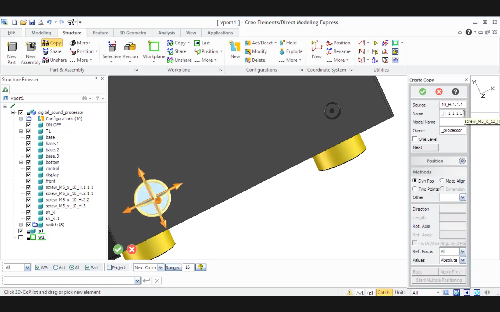

# Design Backlog

Running list of design threads that are open, named, and deliberately
not yet built -- captured here so they don't get lost between
sessions. Add to this as new threads come up; move items to the
relevant area's own doc (or into actual code) once they're resolved.

---

## 1. Position / Mate-Align workflow (HP/CoCreate pattern)

**Status: CORE WORKFLOW COMPLETE.** The full 3-2-1 Mate/Align
sequence is working correctly with true purity of motion, confirmed
via real testing on as1-oc-214.stp (L-bracket positioned onto plate
in three steps: Mate → Align → Align).

**What's working (confirmed via real testing):**
- Position dialog (`gui/position_dialog.py`) fully functional
- Mate, Align, Align Axis, Dynamic Move all wired up and working
- **Full 3-2-1 sequence confirmed:** Mate (3 DOF) → Align (2 DOF) →
  Align (1 DOF), each step consuming only its intended DOF without
  disturbing previously-constrained DOF ("purity of motion")
- **Purity of motion fix:** `compute_mate_move`/`compute_align_move`
  decompose into: (1) pure rotation to align normals, (2) translation
  along normal only to close plane gap. No in-plane movement in step 1.
  Subsequent steps operate only in remaining free DOF.
- **Coordinate frame fix:** world-space moves converted to parent-local
  frame before applying via `_world_move_to_local()`. Required because
  pick coordinates are always world-space but `Shape.move()` operates
  in the parent node's local frame. Without this, nested nodes (e.g.
  l-bracket inside l-bracket-assembly) moved incorrectly while
  top-level nodes (whose parent is at the origin) worked fine.
- Cylindrical face body clicks automatically extract cylinder axis
  (via boundary edge circle-fit, handling BSPLINE-encoded cylinders)
- Reverse button: flips direction of last applied step and re-applies
- Back button: undoes one step correctly
- Face/edge/vertex picking restored correctly after show/hide
- Colors preserved across moves
- Moving node selected via TREE (supports part or assembly)

**Scope (deliberately narrow):** implementing just 2 of CoCreate's
positioning techniques, sufficient for the 90% use case (importing
STEP files and positioning them into an assembly):

1. **Dynamic positioning** -- drag a part to get it out of the way
   of overlapping geometry so you can see it clearly before Mate/Align.
2. **Mate/Align** -- precision placement using face/edge/axis picks.

---

### Typical workflow this supports

1. Import a STEP file → part/assembly appears at top level near origin
2. Drag it in the tree to the correct parent assembly (already works)
3. **Dynamic Move** → drag it somewhere visible, away from existing
   geometry (new)
4. **Mate/Align** → precision placement relative to the assembly (new)

---

### Mate/Align: design confirmed and implemented

**Source:** PTC Creo Elements/Direct Modeling Express documentation,
read directly from the attached PDFs ("Mate or align parts and
assemblies" + "Position a part, assembly, or workplane set").

**Each step commits immediately.** "Back" undoes one step.

**Constraint types:**
- **Mate**: two faces opposing each other on the same plane (face-to-
  face contact). Constrains 3 DOF: 2 rotational + 1 normal translation.
- **Align**: two faces/elements on the SAME side of a plane (flush).
  Constrains 2 DOF (in-plane translation toward alignment).
- **Align Axis**: aligns the axes of two cylindrical/circular
  elements. Constrains up to 4 DOF at once (both translations
  perpendicular to the axis + 2 rotational). Worth exploring as an
  alternative to Mate+Align for cylindrical features.
- **Parallel**: makes faces/edges parallel without coincident
  placement (not in our minimal scope).
- **Offset**: adds a gap value to Mate or Align (not in minimal
  scope, but trivial to add).

**Key implementation details:**
- Moving node always selected via TREE (part or assembly)
- Pick coordinates are world-space (from OCCT); converted to
  parent-local frame before applying via `_world_move_to_local()`
- `compute_mate_move` / `compute_align_move`: rotate to align normals
  (using same-origin from/to planes for pure rotation), then translate
  along normal only by `gap = (pick2.point - pick1.point).dot(target_z)`
- `compute_align_axis_move`: uses full `compute_move()` since axis
  alignment constrains both orientation AND axis position

---

### Next things to explore

1. **Dynamic Move** -- implement click-to-translate for rough
   positioning before Mate/Align.
2. **AIS_Manipulator gizmo** -- the slick drag version, after
   Dynamic Move click-to-translate is working.
3. **Active Part concept** (CoCreate terminology) -- make the
   currently-selected moving node more visually prominent in the
   dialog and/or viewport so it's always clear what's about to move.

---

### Confirmed sequencing patterns (from real testing)

Two distinct positioning sequences have been confirmed working, each
suited to different geometry:

**Pattern A: 3-2-1 (prismatic/flat features)**
1. Mate two faces → 3 DOF (2 rotational + 1 normal translation)
2. Align two faces → 2 DOF (in-plane translation)
3. Align two faces → 1 DOF (remaining in-plane translation)

Confirmed: L-bracket onto plate using all face picks. Each step
consumed exactly its intended DOF without disturbing previous steps.

**Pattern B: Align Axis + Mate (cylindrical features)**
1. Align Axis (hole-to-hole or shaft-to-hole) → 4 DOF (2 rotational
   + 2 translational perpendicular to axis)
2. Mate (face-to-face along the axis direction) → 1 DOF (translation
   along axis to close the gap)

Confirmed: second L-bracket-assembly positioned using a hole in the
bracket aligned to a hole in the plate, followed by Mate of the
bracket bottom face to the plate top face. More efficient than 3-2-1
for cylindrical features (2 steps vs 3).

**CRITICAL ORDER DEPENDENCY for Pattern B:**
Align Axis MUST come before Mate. If Mate is applied first, the
subsequent Align Axis disturbs the mate (it's consuming overlapping
DOF in a conflicting way -- Align Axis constrains 2 rotational DOF
that the Mate also depends on for its plane orientation). Doing Align
Axis first leaves only 1 translational DOF (along the axis) free,
which Mate then cleanly consumes as a pure translation. The purity
of motion property only holds when constraint steps are applied in
order of decreasing DOF consumed: most-constraining step first.

**General rule:** apply the constraint that consumes the MOST DOF
first, then work downward. Align Axis (4 DOF) before Mate (consumes
remaining 1). For prismatic features, Mate (3 DOF) before Align
(2 DOF) before Align (1 DOF) -- the natural 3-2-1 order already
respects this.

**Scope (deliberately narrow):** implementing just 2 of CoCreate's
positioning techniques, sufficient for the 90% use case (importing
STEP files and positioning them into an assembly):

1. **Dynamic positioning** -- drag a part to get it out of the way
   of overlapping geometry so you can see it clearly before Mate/Align.
2. **Mate/Align** -- precision placement using face/edge/axis picks.

---

### Typical workflow this supports

1. Import a STEP file → part/assembly appears at top level near origin
2. Drag it in the tree to the correct parent assembly (already works)
3. **Dynamic Move** → drag it somewhere visible, away from existing
   geometry (new)
4. **Mate/Align** → precision placement relative to the assembly (new)

---

### Mate/Align: fully designed

**Source:** PTC Creo Elements/Direct Modeling Express documentation,
read directly from the attached PDFs ("Mate or align parts and
assemblies" + "Position a part, assembly, or workplane set").

**The open design question is now answered:** each Mate/Align step
commits **immediately** -- "the parts or assemblies become constrained
by each mate or align step." The part moves after each pick pair, not
batched until a final Apply. "Back" undoes one step; "Clear All"
resets the constraint method but leaves the part at its current
(moved) position. This is simpler to implement than the batched
version would have been.

**Constraint types** (confirming Doug's 3-2-1 characterization):
- **Mate**: two faces opposing each other on the same plane (face-to-
  face contact). Constrains 3 DOF: the normal direction + 2
  rotational.
- **Align**: two faces/elements on the SAME side of a plane (flush).
  Constrains 2 additional DOF (in-plane translation).
- **Align Axis**: aligns the axes of two cylindrical/circular
  elements. Maps directly onto `circle_axis` DirectionRef picks,
  already proven working on real STEP geometry.
- **Parallel**: makes faces/edges parallel without coincident
  placement (not in our minimal scope, but documented for later).
- **Offset**: adds a gap value to Mate or Align (not in minimal
  scope, but trivial to add once the basic case works).

---

### Dynamic positioning: COMPLETE

**`AIS_Manipulator` gizmo implemented and confirmed working.**
All 6 DOF: 3 arrows for translation, 3 rings for rotation. Integrated
into the Position dialog as "Dynamic Move" -- select a node in the
tree, click Position, choose Dynamic Move, click Start Step, drag the
gizmo in the viewport, click Done.

Key implementation notes:
- `SyncedViewportWidget` overrides `mousePressEvent`/`mouseMoveEvent`/
  `mouseReleaseEvent` to intercept LMB drag when a manipulator part is
  detected under the cursor (`HasActiveMode()`), suppressing the normal
  orbit behavior
- `DeactivateCurrentMode()` called after `StopTransform()` to reset
  `HasActiveMode()` to False -- without this, orbit is locked out after
  the first drag (confirmed real bug, fixed)
- Slight quirkiness: one extra click away from gizmo sometimes needed
  to fully hand LMB control back to orbit. Acceptable, trainable.
- Transform applied to build123d node via `manipulator.Object()
  .LocalTransformation()` → `Location` → `Shape.move()` with
  parent-local frame conversion (same `_world_move_to_local()` as
  Mate/Align)

---

### Build order: ALL COMPLETE

1. ✅ **Mate/Align UI** -- full 3-2-1 working with purity of motion
2. ✅ **Dynamic Move** -- AIS_Manipulator gizmo, all 6 DOF
3. ✅ **Import STEP** -- load new files mid-session, re-parent, export

---

### Next features (from Doug's list)

1. **RMB context menu in viewport** -- quick access to Fit All and
   other view commands. Simple, high value.
2. **Workplanes + part creation** -- pick a face, create a workplane,
   sketch 2D geometry, extrude/cut to make new parts. See §6 below
   for design notes.

---

---

## 2. Copy vs. Share (shared instances) -- UI confirms this is a real, deliberate feature

**Status:** parked (see `STEP_NOTES.md`'s "shared vs. copied" section
for the full earlier investigation) -- but the CoCreate "Create Copy"
dialog screenshot is new, relevant evidence worth recording here too.

The dialog presents `Copy` and `Share` as an explicit, first-class
choice at the moment a part/assembly instance is created -- not an
automatic side effect of how something happens to be built. This
matches what Doug described wanting weeks ago ("ideally... know that
by looking at the assembly tree") and confirms it's a real, deliberate
CoCreate feature, not a nice-to-have invention.

Still not chasing full container-level sharing right now (per "let's
see how far we can go on the well-trodden road" -- build123d's
`import_step()`/`Compound` model doesn't preserve it, confirmed via
`diagnose_shared_instances.py`). But this screenshot is worth keeping
on file: if/when this gets revisited, the UI pattern to copy is
"Copy/Share chosen up front, Position dialog appended right after,"
not a separate later command.

---

## 3. Undo / Redo

**Status:** investigated tonight, real open question identified,
NOT YET RESOLVED -- flagging per Doug's request before further design
or implementation happens here.

**Good news:** OCCT's `TDocStd_Document` (OCAF's document class) has
real, built-in transactional undo/redo -- not partial, not
aspirational:
- `NewCommand()` opens a transaction; `CommitCommand()` closes it and
  records a delta; `Undo()`/`Redo()` step through committed deltas.
- `SetUndoLimit(n)` controls history depth (0 = disabled/default,
  negative = unlimited).
- Confirmed via OCCT's own class reference docs, not just a forum
  guess.

**Two confirmed caveats:**
- **Session-only.** Directly confirmed by an OCCT forum supervisor:
  "There is no possibility to store the undo/redo information in the
  OCCT TDocStd_Document... this is out of scope of the functionality
  of most standard applications." Undo history does not survive
  save/reload. This is normal for most CAD tools (not a red flag),
  but worth knowing going in.
- **Known footgun:** a confirmed forum bug report shows `NewCommand()`
  can hang indefinitely with NO error if you're using a custom
  `TDocStd_Application` subclass that doesn't correctly implement the
  required virtual methods -- fix was switching to the standard
  `AppStdL_Application`/`AppStd_Application` or implementing the
  methods properly. Worth remembering if `NewCommand()` ever just...
  never returns.

**THE OPEN QUESTION (not yet answered):** `TDocStd_Document`
undo/redo operates on OCAF's own data framework (TDF labels and
attributes). Our actual data model is build123d's `Compound`/anytree
Python object tree -- a layer ABOVE OCAF, not OCAF itself. It is NOT
YET VERIFIED whether mutating `Compound.children` tuples in Python
(how `remove_node`/`add_node`/the tree widget currently work) routes
through OCAF's document/transaction system at all. If it doesn't,
`TDocStd_Document`'s undo/redo has nothing to undo, and we'd need a
different strategy -- most likely an application-level undo stack
(command pattern / snapshot-diff over our own Python tree state)
instead of relying on OCAF's built-in mechanism.

**Next step when this gets picked up:** a small, isolated diagnostic
(same discipline as `diagnose_global_location.py` /
`diagnose_shared_instances.py`) -- build a tiny assembly, wrap a
`remove_node()` call in `NewCommand()`/`CommitCommand()`, call
`Undo()`, and empirically check whether the tree actually reverts.
Don't assume either way; check.

**Lowered urgency, not closed:** per the file-format discussion
below, Doug's KodaCAD-era precedent was to use frequent STEP export
as a "poor man's undo" -- acceptable, not blocking. Real undo is a
nice-to-have for now, not a prerequisite for the next phase of work.
The open technical question above (does OCAF's transaction system see
build123d-level mutations at all) is still worth answering eventually,
just not urgently.

---

## 4. File storage format

**Status:** discussed once, tentatively settled as "not a
show-stopper" -- not a final decision, but no longer fully open
either.

At least three separable questions, not one:
1. **Interchange format** -- STEP. Already solid; this is settled,
   proven extensively (see `STEP_NOTES.md`).
2. **Native/working format** -- does the app need its own save format
   for in-progress work, to round-trip things STEP can't represent
   (construction geometry, sketch history if any is kept, the
   copy/share distinction from item 2 above if STEP export doesn't
   preserve it, undo history if we ever wanted that to survive a
   session -- though see item 3's caveat that OCAF itself doesn't
   support this)?
3. If a native format is needed: roll our own (e.g. JSON schema
   wrapping STEP + extra metadata) vs. an existing OCAF persistence
   format (`BinOcaf`/`XmlOcaf`, mentioned in passing during the
   undo/redo research) vs. something else entirely.

**Precedent from the original KodaCAD project:** Doug's prior
approach was to use STEP itself as a "poor man's native format" --
just export STEP frequently, including as a stand-in for undo (export
often enough that an unwanted change can be recovered by reloading an
earlier export). Acknowledged as "kind of lame," but functional.

**Current read:** in the context of THIS project -- a from-scratch
app with no legacy users/files to migrate, and STEP round-tripping
already proven solid (including hierarchy, color, and assembled
position) -- it's reasonable to conclude native format and "real"
undo persistence are NOT show-stoppers. Frequent STEP export remains
a perfectly viable safety net, same as before. Not formally closing
this thread (a native format could still be worth building later, if
e.g. construction geometry or sketch history end up needing to be
preserved across sessions), but it's not blocking anything right now
and doesn't need a dedicated design session soon.

---

## 5. Picking -> pose -> move -> export, proven end to end (this session)

**Status: DONE.** This was the big push this session, and every piece
of it now works on real geometry from `as1-oc-214.stp`, not just
synthetic test data. Worth a permanent record since several real bugs
got found and fixed along the way -- future debugging should check
this list before assuming something new is broken.

### Picking: face, edge, and vertex selection

Two real, confirmed bugs, both fixed:

- **`AIS_Shape` selection-mode mismatch.** `AIS_Shape`'s own
  selection-mode integers are NOT guaranteed to equal
  `TopAbs_ShapeEnum`'s values -- there's a documented, sanctioned
  translation method, but this OCP build exposes it as the STATIC
  form `AIS_Shape.SelectionMode_s(TopAbs_EDGE)` (called on the class),
  not an instance method. Passing `TopAbs_FACE` directly had "worked"
  only by numeric coincidence; `TopAbs_EDGE` did not, which is why
  edge clicks were returning `TopAbs_SOLID` instead of `TopAbs_EDGE`.
  **Remember this pattern** (`Did you mean: 'X_s'?` in a traceback)
  generally -- it's the same `_s`-suffix-means-static convention that
  bit us once before during the STEP export investigation
  (`FindShape`/`FindShape_s`).
- **Default 2px selection tolerance.** OCCT's default pick tolerance
  is tiny -- fine for faces (which cover most of a solid's visible
  area) but makes edges/vertices nearly unhittable by eye. Fixed via
  `SetSelectionSensitivity()`.

Result: face, straight edge, and vertex picking all confirmed working
in the live app, including on a real multi-part, multiply-instanced
assembly.

### The `GeomType` enum comparison bug

`geom_type` returns a real `GeomType` ENUM, not a string -- confirmed
via build123d's own documented examples (`e.geom_type ==
GeomType.CIRCLE`). Every `geom_type == "CIRCLE"` string comparison in
this codebase (in BOTH `pose.py`'s original circle resolution AND
`assembly_viewer.py`'s terminal reporting) was wrong from the start --
meaning a genuinely circular edge may never have correctly hit the
"fast path" even before any of tonight's other work. Fixed at the
root in both files. Worth grepping for `== "CIRCLE"` or similar bare
string comparisons against any OTHER enum-returning property if this
class of bug is ever suspected elsewhere.

### Circle-fit fallback for non-CIRCLE-typed circular edges

Confirmed REAL (not hypothetical): `as1-oc-214.stp`'s `rod` part has
its end-cap boundary split into SEMI-circular arc edges (confirmed by
Doug's own topology analysis: the rod is 4 shells -- 2 flat circular
ends + 2 semi-cylindrical sides, joined along 2 longitudinal seams),
and at least one such arc is encoded as `geom_type == BSPLINE`, not
`CIRCLE`, despite being geometrically circular. `pose.py` now falls
back to a from-scratch least-squares circle fit (Kasa method) when
`geom_type` isn't `CIRCLE`, verified against: a full synthetic
circle, a half-circle (matching the real rod case), AND a straight
edge (which must be cleanly REJECTED, not crash -- see below). All
three are now permanent, hard-assertion regression tests in
`pose.py`'s `_self_test()`.

**A real bug found via live picking, not caught by any prior test:**
the fit's normal-estimation step sums cross products of sampled point
pairs; for COLLINEAR points (i.e. calling the circle-fit on an
ordinary STRAIGHT edge -- which happens on EVERY edge pick, since
circle_center/circle_axis is tried first regardless of geom_type),
every cross product is the zero vector, and normalizing a zero vector
throws OCCT's `Standard_ConstructionError` -- NOT a Python
`ValueError`, so it silently escaped every `except ValueError:`
handler built around the function. Confirmed via real picking: two
ordinary straight edges on `plate` crashed with this exact error.
Fixed by detecting the degenerate case explicitly and raising a clean
`ValueError` before ever calling `.normalized()`. This gap existed
because every prior test only ever fed the fit genuinely curved
input -- now covered by a dedicated straight-edge rejection test.

### Moving a part: `Shape.move()`, not `.location.position +=`

Doug's instinct -- "why do we need to do ANYTHING with the assembly
structure, we're just moving one part" -- was correct, and led
directly to both finding a real bug and the simpler, correct fix.

**The bug:** `rod.location` returns a DETACHED COPY of the shape's
location, not a live reference. `rod.location.position += delta`
mutates that throwaway copy -- no exception, because the operation is
valid Python, it just never touches `rod` itself. Confirmed via real
testing: before/after position printouts were silently IDENTICAL.
This also means the FIRST attempted fix (`rod.moved(move)` +
`remove_node()`/`add_node()` tree surgery to swap the new object in)
was unnecessary complexity that ALSO directly caused a separate,
serious bug: re-exporting after that tree surgery corrupted
`rod-assembly` into STEP header text (`Open CASCADE STEP translator
7.9.1.1`) in the exported file, confirmed via CAD Assistant.

**The fix:** `rod.move(delta)` -- build123d's own documented method,
explicitly described as "relative change of THIS object" (the other
three methods in their 2x2 matrix: `locate`=absolute+this,
`located`=absolute+copy, `moved`=relative+copy). In-place, no new
object, NO tree restructuring needed at all -- confirming Doug's
original intuition was right both in spirit and in the specific
mechanics. Verified end to end: numeric shift (50.0000mm along axis,
0.000000 perpendicular), in-memory tree print (confirmed untouched),
export, and reload in CAD Assistant (rod visibly, correctly moved).

**Test script:** `gui/test_move_rod_axially.py` -- kept as a
standalone, runnable reference for "pick real geometry -> resolve a
pose -> move a real part -> export -> verify," the first time this
full chain was exercised together.

---

## 6. Workplanes and Part Creation

**Status:** not yet started. Next major feature after RMB menu.

**What a workplane is:** a finite rectangular plane displayed in the
viewport with its own U/V coordinate system (pink grid lines in
CoCreate's UI). It defines a 2D sketching surface anchored to 3D
geometry. See attached screenshot `docs/imgs/new-wp_cg.png` for
CoCreate's reference UX.

**CoCreate's creation options** (from the Workplane panel):
- **New** -- default, placed at origin
- **On Face** -- coincident with a picked face ← PRIMARY USE CASE
- **On Axis** -- aligned with a cylinder/edge axis
- **By Pnt & Dir** -- point + direction vector
- **Project Geo** -- projects existing geometry onto the workplane
- **Project Constr** -- projects construction geometry

**For our 90% use case** (simple mounting plates and brackets),
"On Face" is the primary workflow:
1. Pick an existing face in the viewport
2. A workplane appears coincident with that face
3. Sketch 2D geometry on the workplane (lines, circles, rectangles)
4. Extrude or cut to create a new 3D part
5. The new part appears in the tree as a new node, ready to position

**build123d connection:** build123d has first-class workplane support
via `Workplane` / `BuildSketch` / `BuildPart` context managers.
The face-picking infrastructure built for Mate/Align (face normal,
face center, face plane) is directly reusable for workplane creation:
pick a face → `PointRef(kind="face_center")` + `DirectionRef(kind=
"face_normal")` → `Plane(origin, z_dir)` → build123d `Workplane`.

**Display:** workplane rendered in the OCCT viewport as a transparent
colored rectangle with U/V axis lines. `AIS_Plane` or a custom
`AIS_Shape` built from a flat rectangular face.

**Sketch UI:** the hardest part. Options:
- Minimal: keyboard-driven entry of dimensions (extrude a rectangle
  of width W, height H -- no freehand drawing needed for simple
  mounting plates)
- Full: 2D sketch editor with line/circle/rectangle tools
Start minimal, add sketch tools if needed.

**Scope decision (deferred):** decide at session start whether to
implement minimal (dimension-driven extrusion only) or full sketch
UI. Minimal is likely sufficient for the 90% use case and much
faster to build.

---

## 7. RMB Context Menu in Viewport

**Status: COMPLETE** (with one known issue noted below).

RMB in the viewport opens a menu with: Fit All, Fit Selected,
Reset View (isometric), View Top, View Front, View Right.

**AIS_ViewCube also added** -- orientation cube in the bottom-right
corner (same as CAD Assistant). Clicking edges (12) and corners (8)
works correctly, animating the camera to the corresponding view.

**Known issue: face clicks on the view cube cause a crash.**
Clicking one of the 6 face labels (TOP, FRONT, RIGHT, etc.) produces
a white viewport and then a C++ segfault -- nothing printed to
terminal, not catchable by Python try/except. Root cause is inside
OCCT's own animation or camera-setting code when triggered by a face
owner. Edges and corners use a different code path and work fine.

**Workaround:** use the RMB menu's View Top/Front/Right items for
standard orthographic views. Avoid clicking the view cube's flat
faces. This is acceptable behavior -- edges and corners cover the
isometric views that are most useful during 3D work anyway.

**TODO (low priority):** investigate whether disabling the face
sensitive zones entirely (`vc.SetDrawVertices(False)` equivalent for
faces) prevents the crash while keeping edge/corner clicks working.
Or wait for a newer OCP build where this may be fixed upstream.

